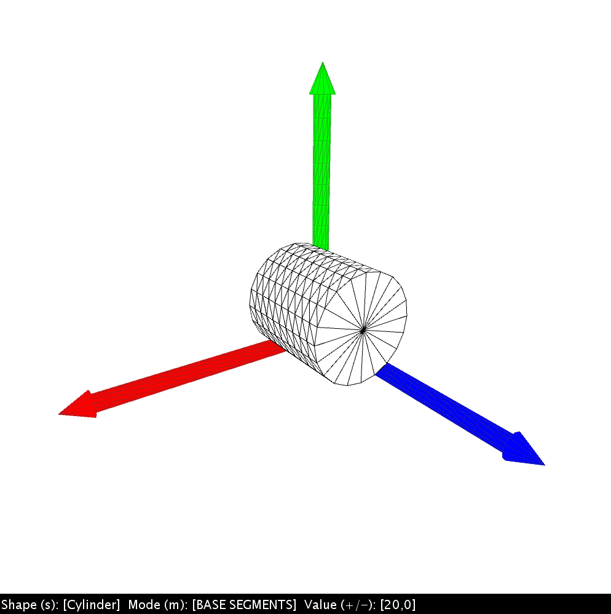
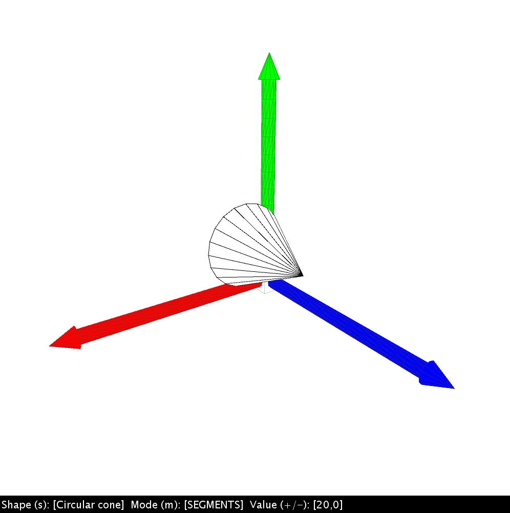

# Laboratory submission - Task Sheet 4

    
     
    
    

> This folder contains the Processing Sketch and other documents for Task Sheet 4 in the 3D Computer Graphics Lab.

## Task

[PDF document](Arbeitsblatt4.pdf) for task sheet 4.

**Summary of the task to be processed for the Processing-Sketch**

> The goal of the worksheet is for you to learn how to construct complex solids from basic geometric primitives using transformations.
>
> **Task 1**
> Create one class each for geometric modeling of cylinders and one for modeling circular cones.
>
> The model for **circular cones** should take into account the following parameters:
>
> - `radius` : **radius** of the circular base surface
> - `height ` : **height** of the top of the shell surface above the base surface
> - `segments` : number of segments of the **base and shell surfaces**.
> - Use the drawing mode **`TRIANGLE_FAN`** for both surfaces
>
> The model for **cylinders** should take into account the following parameters:
>
> - `radius `: **radius** of the circular top and bottom surfaces
> - `height` : **height** of the cylinder
> - `baseSegments` : number of segments for the fan-shaped segmentation of the **circular top surfaces** into triangles
> - `sideSegments` : number of segments in the case of the annular decomposition of the **lateral surface** into triangles
> - Use the drawing modes **`TRIANGLE_FAN`** for the top surfaces and **`TRIANGLE_STRIP`** for the lateral surfaces.
>
> The classes shall have a method **`render()`** that can be called in the **`draw()`** function of the sketch to draw a cylinder or circular cone with the appropriate parameters. 
>
> It shall also be possible to change all parameters of the geometric modeling interactively via the keyboard.
>
> **Task 2**
> Create a class to render a 3D coordinate system of cylinders and circular cones. Drawing the coordinate system should also be done here in a **`render()`** method. Uses the classes from task 1 to draw the primitives that make up the coordinate system.
>
> Orient to the representation of coordinate systems in 3D modeling programs:
>
> - An arrow from a cylinder and a circular cone illustrates the orientation of a main axis of the coordinate system.
> - All axes of the 3D coordinate system start at the origin of the coordinate system and point in the positive direction.
> - To identify the individual axes, they are marked with the basic colors of the RGB color space.

## Realization

- The implementation occured with the [Processing](https://processing.org/) 3.5.4 library (included).
- IntelliJ IDEA Ultimate 2020.2 development environment has been used.

## Usage (Key/Mouse map)

- Mouse
  - `Left mouse click` : translate the coordinate system
  - `Right mouse click` : rotate the coordinate system
- Keyboard
  - `s` : Select shape [NONE, CIRCULAR CONE, CYLINDER]
  - `m` : Select manipulation mode
  - `+/-` : Manipulate value of selected manipulation mode

## Demo

## Contact

**Philipp Borucki (philipp.borucki@stud.hs-flensburg.de)**

## License

Copyright 2021 Philipp Borucki. 
This project is licensed under a proprietary license and is limited to the restrictions of intellectual property rights for academic writing and submission of laboratory work.

The use for demonstration purposes, especially in teaching and research, is expressly desired and permitted.

***
